 

### 🧠 Learn • Think • Build • Grow 🚀

## 👋 Hi, I'm Satish Yadav

> 🎓 B.Tech CSE Student | 💻 Aspiring Software Engineer | 🧠 Problem Solver

I'm passionate about learning new technologies, solving problems,
and turning ideas into practical projects.

- 📚 Currently learning **Java, DSA & Web Development**
- 🧩 Practicing **Data Structures & Algorithms**
- 🚀 Building projects and improving my coding skills
- 🔍 Always curious to learn something new
- 🎯 Focused on becoming a better programmer every day

 <h2>🛠️ Tech Stack</h2>

<h3>💻 Programming</h3>

<h3>🌐 Web Development</h3>

<h3>🗄️ Database</h3>

<h2>🔧 Tools</h2>

## 📚 Currently Learning

  

## 🚀 Featured Projects

### 🎓 College Student Management System

A complete college management project designed to manage student admission,
student details, fees, and login functionality.

**Tech Used:** C • HTML • CSS • JavaScript

🔗 **Project:**  
<a href="https://github.com/Satish-53/Student-Management-System">
  View Project →
</a>

---

### 🧠 DSA & LeetCode Practice

Regularly practicing Data Structures & Algorithms and solving coding problems
to improve problem-solving and programming skills.

🔗 **LeetCode:**  
<a href="https://leetcode.com/u/Satish53/">
  View LeetCode Profile →
</a>

## 🎯 2026 Goals

| Goal | Progress |
|------|----------|
| 🧠 Master DSA | 🔄 Learning |
| 💻 Solve 300+ LeetCode Problems | 🔄 In Progress |
| 🚀 Build Real-World Projects | 🔄 In Progress |
| 🌐 Improve Web Development | 🔄 Learning |
| 🤝 Contribute to Open Source | 🎯 Planned |

## 💻 Coding Journey

🚀 Learning Java & Data Structures and Algorithms  
 
🧩 Solving LeetCode Problems Regularly  
 
🌐 Building Web Development Projects  
 
🔧 Learning Git & GitHub  
 
📈 Improving Problem-Solving Skills Every Day

## 📊 GitHub Statistics

## 🧩 LeetCode</h2>

## 📫 Connect With Me

## 🏆 GitHub Profile

## 🚀 More Projects

| Project | Technology | Link |
|---------|------------|------|
| 🎓 College Student Management System | C, HTML, CSS, JavaScript | [View Project](https://github.com/Satish-53/Student-Management-System) |
| 🧩 DSA & LeetCode Practice | Java | [View Profile](https://leetcode.com/u/Satish53/) |

## 👀 Profile Visitors

## 🌟 Thanks for Visiting!

💡 Keep Learning • Keep Building • Keep Growing 🚀

